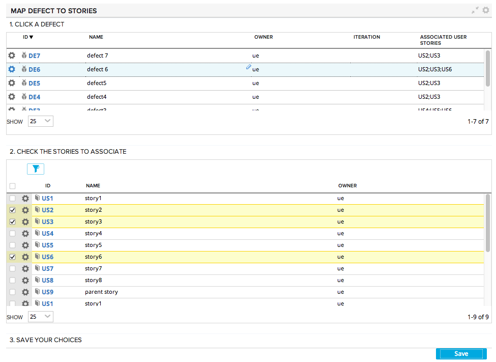

Map Defects to Stories
=========================

## Overview
Once the workspace is setup, this app allows the user to save a list of User Story FormattedIDs
to a defect. This workarounds the current limitation of only allowing one parent story per defect.

## License

AppTemplate is released under the MIT license.  See the file [LICENSE](./LICENSE) for the full text.

##Documentation for SDK

You can find the documentation on our help [site.](https://help.rallydev.com/apps/2.0/doc/)
